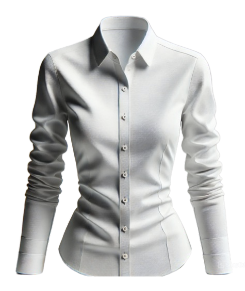
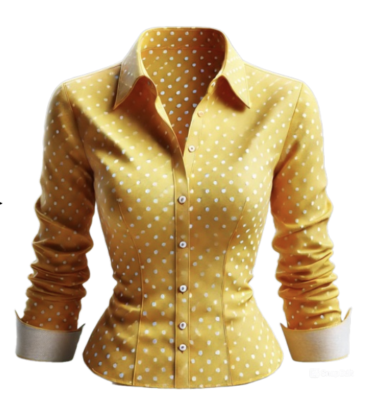
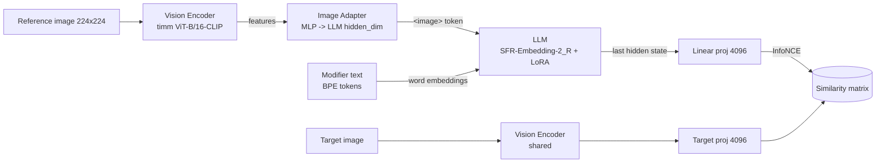

# Fashion-Finder

**Project name:** Fashion-Finder — Photo Search by Text Hint
**Author:** Elizaveta Finenko ([finenko.ea@phystech.edu](mailto:finenko.ea@phystech.edu))
**Course:** MIPT MLOps, Spring 2026

---

## Быстрая проверка

```bash
git clone https://github.com/filzzzy/fashion-finder.git
cd fashion-finder
bash scripts/verify.sh
```

Скрипт ставит `uv` (если его нет), синкает зависимости, прогоняет pre-commit и pytest, тянет MT-CIR (500 строк) и кусок Fashion-IQ (по 30 пар на каждый сплит, реальные картинки с Amazon через зеркало), и запускает smoke-тренировку. На M-маке занимает 5–8 минут.

Чекпоинт окажется в `checkpoints/`, графики уже лежат в `plots/`, MLflow поднимется на http://127.0.0.1:8080.

Отдельные шаги — в [Setup](#setup), [Train](#train), [Infer](#infer), [Production preparation](#production-preparation).

---

## Постановка задачи

Fashion-Finder — это сервис поиска целевого изображения в каталоге одежды по комбинированному запросу: **референсное изображение + текстовый модификатор**. Задача относится к классу Composed Image Retrieval (CIR) и применима в e-commerce, рекомендательных системах и системах визуального поиска.

### Пример запроса

| Reference (вход)                                 | Text modifier (вход)    | Target (ожидаемый выход)                   |
| ------------------------------------------------ | ----------------------- | ------------------------------------------ |
|  | `"is yellow with dots"` |  |

### Протокол ввода/вывода (инференс)

|                    | Формат                                                                 | Размер                |
| ------------------ | ---------------------------------------------------------------------- | --------------------- |
| Вход — изображение | RGB JPEG/PNG, ресайз до 256, центр-кроп 224×224                        | ≤ 1 МБ                |
| Вход — текст       | строка UTF-8, ≤ 64 BPE токенов (truncation)                            | ≤ 200 символов        |
| Выход — top-K      | JSON `{"results": [{"rank": int, "score": float, "image": str}, ...]}` | K = 10 (по умолчанию) |

API: HTTP через Triton Inference Server (порт 8000) либо CLI (`infer.py`).

### Метрики (5 показателей)

| Метрика     | Семантика                                         | Целевое значение                                                                              |
| ----------- | ------------------------------------------------- | --------------------------------------------------------------------------------------------- |
| Recall@1    | целевая картинка на 1-м месте                     | ≥ 0.18 (бейзлайн ARTEMIS [Delmas et al. 2022] R@10 = 25%)                                     |
| Recall@5    | целевая картинка в top-5                          | ≥ 0.30                                                                                        |
| Recall@10   | целевая картинка в top-10                         | ≥ 0.40 (бейзлайн TIRG [Vo et al. 2019] R@10 = 17.7%; CIRPLANT [Liu et al. 2021] R@10 = 18.5%) |
| Recall@50   | целевая картинка в top-50                         | ≥ 0.60                                                                                        |
| Mean Recall | среднее R@10 и R@50 по всем категориям Fashion-IQ | ≥ 0.50 (используется как primary checkpoint metric)                                           |

Источники бейзлайнов: [Wu et al. 2021 Fashion-IQ paper](https://arxiv.org/abs/1905.12794), [CIRR Liu et al. 2021](https://arxiv.org/abs/2108.04024), [ARTEMIS Delmas et al. 2022](https://arxiv.org/abs/2203.08101). Текущая reference-реализация на нашем checkpoint показывает R@10 ≈ 0.39 / R@50 ≈ 0.61, что подтверждает реалистичность целей.

### Датасеты

|                | Источник                                                            | Размер                                  | Дата | Авторы                    | Использование           |
| -------------- | ------------------------------------------------------------------- | --------------------------------------- | ---- | ------------------------- | ----------------------- |
| **MT-CIR**     | [chuonghm/MT-CIR](https://huggingface.co/datasets/chuonghm/MT-CIR)  | ≈ 3.5 M пар, ~250 GB                    | 2024 | Hoang et al.              | Pretraining             |
| **Fashion-IQ** | [XiaoxiaoGuo/fashion-iq](https://github.com/XiaoxiaoGuo/fashion-iq) | 77 684 изображения, 30 134 пары, ~12 GB | 2019 | Wu, Gao, Guo et al. (IBM) | Finetuning + validation |

Особенности и сложности:

- **Шум аннотаций** в MT-CIR (автоматически сгенерированные VLM-описания) — компенсируется большим объёмом и word-dropout аугментацией.
- **Дисбаланс категорий** в Fashion-IQ: dress / shirt / toptee, неодинаковое число пар на категорию (валидируем по каждой категории отдельно, summarise через mean recall).
- **Неоднозначность модификаторов**: одна пара может иметь несколько корректных описаний (для val/test усреднение по двум independent captions).
- **Размер vision-language модели** требует LoRA + bf16 + gradient checkpointing для входа в 24 GB VRAM.

### Валидация и воспроизводимость

- Сплиты Fashion-IQ — официальные `cap.{dress,shirt,toptee}.{train,val,test}.json` из репозитория.
- MT-CIR используется только на стадии pretraining (без val/test).
- `seed = 42` фиксируется через `pl.seed_everything(workers=True)`.
- Версия кода логируется в MLflow как `git_commit` hyperparam.
- Конфиги резолвятся через Hydra, итоговый снапшот пишется в `resolved_config.yaml` в директорию запуска.

## Моделирование

### Бейзлайн (zero-shot CLIP)

Не входит в основной репозиторий, но описан как точка отсчёта: эмбеддинг текста и эмбеддинг изображения от CLIP-ViT-B/16 складываются, нормализуются, и используются для FAISS-поиска по галерее.

### Основная модель: CoLLM

Архитектура построена по схеме [CoLLM: A Large Language Model for Composed Image Retrieval (Huynh et al., 2025)](https://arxiv.org/abs/2503.19910): vision encoder + LLM с LoRA-адаптерами, объединённые через image adapter.



Стадии пайплайна:

1. **Препроцессинг**
   - Image: PIL → RGB → resize/crop → tensor → normalize(0.5, 0.5)
   - Text: `AutoTokenizer(SFR-Embedding-2_R)` + special token `<image>` → padded ≤ 64 BPE токенов
2. **Forward**
   - Vision encoder → MLP image adapter → токен `<image>` подменяется в input embeddings LLM
   - LLM пробрасывает последовательность, забираем hidden state последнего ненулевого токена
   - Linear projection → `embed_dim=4096`
3. **Loss**: InfoNCE (двусторонняя cross-entropy) с обучаемым `logit_scale`
4. **Постпроцессинг**: L2-нормализация эмбеддингов, FAISS HNSW32 индекс по галерее

### Стадии обучения

| Этап     | Датасет          | Эпохи | Замороженные части                            | LR   | Прецизион  |
| -------- | ---------------- | ----- | --------------------------------------------- | ---- | ---------- |
| Pretrain | MT-CIR           | 3     | Vision encoder                                | 1e-4 | bf16-mixed |
| Finetune | Fashion-IQ train | 10    | Vision encoder (LoRA в LLM активна с эпохи 0) | 1e-4 | bf16-mixed |

## Внедрение

### Формат модели и ресурсы

- **Production-формат:** ONNX (опсет 17) для онлайн-инференса; TensorRT plan (FP16) для batched инференса под GPU.
- **Артефакты поставки:**
  - `fashion_finder_vision.onnx` (~700 MB) — кодирует элементы галереи
  - `fashion_finder_composer.onnx` (~7 GB) — кодирует composed-запрос (image + text)
  - `gallery.faiss` + `.manifest.json` — индекс HNSW32, ~2 GB на 50k картинок
  - `tokenizer/` — токенайзер из HuggingFace
- **Минимальные ресурсы:**
  - Inference (CPU): 8 vCPU / 16 GB RAM / ~250 ms на запрос
  - Inference (GPU T4, TensorRT FP16): ~35 ms на запрос
  - Throughput при batch 16 на T4: ≈ 400 QPS

### Пайплайн инференса

1. HTTP `POST /v2/models/fashion_finder_composer/infer` с тензорами `images`, `input_ids`, `attention_mask`
2. Triton возвращает 4096-мерный embedding
3. Клиент посылает embedding в FAISS HNSW индекс → top-K id
4. Манифест маппит id → URL/идентификаторы изображений
5. Ответ JSON: `{"results": [{"rank": 1, "score": 0.83, "image": "B003GUI9MA.jpg"}, ...]}`

---

## Setup

Требуется Python 3.10–3.12 и [uv](https://github.com/astral-sh/uv).

```bash
git clone <repo-url> fashion-finder
cd fashion-finder
uv sync --extra dev --extra serving
source .venv/bin/activate
pre-commit install
pre-commit run --all-files
```

### Загрузка данных

DVC настроен на локальное хранилище (`.dvc/storage_data`, `.dvc/storage_models`). Чтобы получить данные, выполните:

```bash
uv run fashion-finder download-data --root data
uv run dvc add data/mt_cir data/fashion_iq
uv run dvc push -r data_storage
```

или (без DVC) — функция `download_data` напрямую тянет MT-CIR с HuggingFace и Fashion-IQ caption JSON с GitHub.

### Запуск MLflow

```bash
uv run mlflow server --host 127.0.0.1 --port 8080 \
    --backend-store-uri sqlite:///mlflow.db \
    --default-artifact-root ./mlartifacts
```

## Train

### Quick smoke (5 минут, без GPU)

Эта команда — то, что нужно проверить:

```bash
uv run fashion-finder finetune --overrides "trainer=smoke"
```

Запускает 20 train-батчей + 10 val-батчей на `HuggingFaceTB/SmolLM2-135M` (LLM) + `vit_tiny_patch16_224` (vision). Loss падает, чекпоинт сохраняется в `checkpoints/`, метрики в MLflow.

### Полное обучение

```bash
uv run fashion-finder pretrain
uv run fashion-finder finetune --checkpoint outputs/<run>/checkpoints/last.ckpt
```

Hydra-оверрайды (передаются как одна строка через `--overrides`):

```bash
uv run fashion-finder finetune --overrides "data.batch_size=16 trainer.max_epochs=20 model.learning_rate=5e-5"
```

Каждый запуск создаёт папку `outputs/YYYY-MM-DD/HH-MM-SS/` с `checkpoints/`, `tb_logs/`, `resolved_config.yaml`, `training_summary.json`. После обучения автоматически сохраняются графики в `plots/` (см. ниже).

## Production preparation

```bash
uv run fashion-finder export-onnx \
    --checkpoint outputs/.../checkpoints/last.ckpt
./scripts/export_tensorrt.sh checkpoints/onnx checkpoints/tensorrt fp16
```

После экспорта скопируйте ONNX файлы в Triton model repository:

```bash
cp checkpoints/onnx/fashion_finder_vision.onnx triton/model_repository/fashion_finder_vision/1/model.onnx
cp checkpoints/onnx/fashion_finder_composer.onnx triton/model_repository/fashion_finder_composer/1/model.onnx
```

## Infer

### Standalone (FAISS + ONNX Runtime)

```bash
uv run python infer.py build-index \
    --vision-onnx checkpoints/onnx/fashion_finder_vision.onnx \
    --gallery-dir data/fashion_iq/images \
    --output-index-path checkpoints/onnx/gallery.faiss

uv run python infer.py query \
    --composer-onnx checkpoints/onnx/fashion_finder_composer.onnx \
    --index-path checkpoints/onnx/gallery.faiss \
    --query-image examples/query.jpg \
    --query-text "longer sleeves and darker color" \
    --top-k 10
```

### Triton Inference Server

```bash
docker run --rm --gpus=all -p8000:8000 -p8001:8001 -p8002:8002 \
    -v $PWD/triton/model_repository:/models \
    nvcr.io/nvidia/tritonserver:24.05-py3 \
    tritonserver --model-repository=/models

uv run python triton/test_client.py \
    --image examples/query.jpg \
    --text "longer sleeves" \
    --url localhost:8000
```

## Overall structure

```
fashion-finder/
├── README.md
├── pyproject.toml
├── uv.lock
├── .pre-commit-config.yaml
├── .gitignore
├── .dvc/
│   └── config            # local data_storage + models_storage remotes
├── configs/
│   ├── config.yaml       # hierarchical Hydra entry point
│   ├── data/{mt_cir,fashion_iq}.yaml
│   ├── model/collm.yaml
│   ├── trainer/{pretrain,finetune}.yaml
│   ├── logging/mlflow.yaml
│   └── inference/{onnx,tensorrt}.yaml
├── fashion_finder/
│   ├── data/             # MTCIRDataset, FashionIQDataset, transforms, download
│   ├── models/           # CoLLMArchitecture, CompositionLitModule
│   ├── train/train.py    # Lightning pipeline
│   ├── export/to_onnx.py # ONNX export of vision + composer
│   ├── infer/infer.py    # FAISS index build + search
│   ├── utils/            # callbacks, viz, git_utils
│   └── cli.py            # fire entry-point
├── commands.py           # repo-root CLI entrypoint
├── infer.py              # repo-root inference API
├── scripts/
│   └── export_tensorrt.sh
├── triton/
│   ├── model_repository/{fashion_finder_vision,fashion_finder_composer}/
│   ├── test_client.py
│   └── README.md
├── plots/                # training curves saved post-fit
└── tests/                # smoke tests
```

## Logging

- **MLflow** server at `http://127.0.0.1:8080` (configurable via `logging.mlflow_tracking_uri`).
  Logged per run: train/loss, val/R1, val/R5, val/R10, val/R50, val/mean_recall, train/logit_scale, learning_rate, плюс все hyperparams и `git_commit`.
- **TensorBoard** локальная копия в каждой `outputs/.../tb_logs/`.
- После каждого finetune-запуска в `plots/` сохраняются графики train_loss.png, val_recall.png, learning_rate.png.

## License

MIT.
